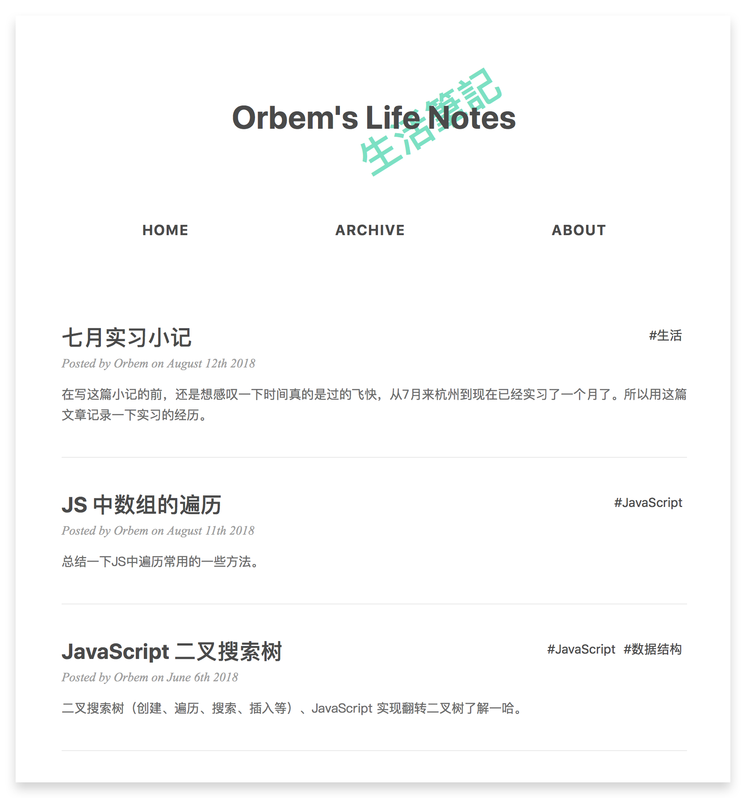

# OSimple

一个~~简单~~简洁的 hexo 主题，待完善中。

# Preview




## Plan to do

- [x] Markdown 样式
- [x] 代码高亮
- [x] 归档展示
- [x] 标签展示
- [x] 底部外链支持：微博、知乎、掘金、Github、Twitter
- [x] Disqus 评论
- [ ] 使用文档
- [ ] 响应式设计
- [ ] 多主题色
- [ ] 返回顶部
- [ ] 多语言支持

## How to use

1. Download from Github

```shell
$ cd your-hexo-site/themes
$ git clone https://github.com/orbem/hexo-theme-osimple.git
```

2. Install dependencies

```shell
$ cd your-hexo-site
$ npm install hexo-renderer-scss --save
```

3. Set the `theme` field in **your site** `_config.yml` to `osimple`

```yaml
...
theme: osimple
```

## Update

```shell
$ cd your-hexo-site/themes/osimple
$ git pull
```

